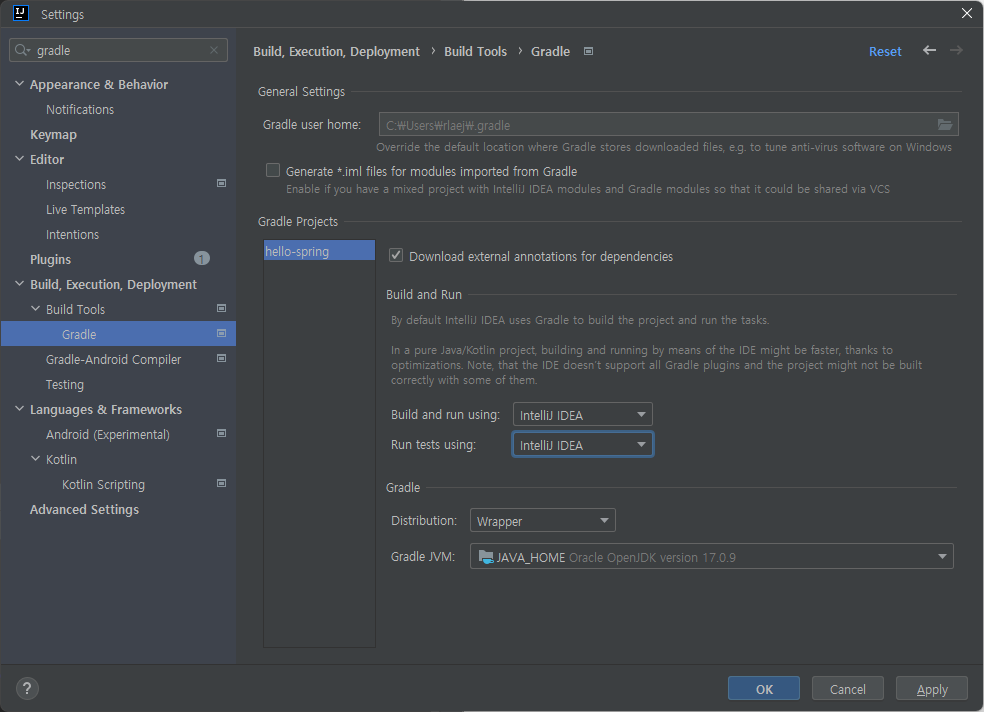

# Spring-20231110
Spring Project

- [Spring-20231110](#spring-20231110)
- 
	- [소개](#소개)
		- [간단한 웹 애플리케이션 개발](#간단한-웹-애플리케이션-개발)
		- [프로젝트 사용 기술](#프로젝트-사용-기술)
	- [프로젝트 환경설정 1110](#프로젝트-환경설정-1110)
		- [프로젝트 생성](#프로젝트-생성)
		- [Project](#project)
		- [IntelliJ Gradle 대신에 자바 직접 실행](#intellij-gradle-대신에-자바-직접-실행)

#

## 소개

### 간단한 웹 애플리케이션 개발

- 스프링 프로젝트 생성
- 스프링 부트로 웹 서버 실행
- 회원 도메인 개발
- 웹 MVC 개발
- DB 연동 - JDBC, JPA, 스프링 데이터 JPA
- 테스트 케이스 작성

### 프로젝트 사용 기술

- Spring Boot
- JPA (Java Persistence API)
- Gradle
- HIBERNATE
- Thymeleaf
- Apache Tomcat

## 프로젝트 환경설정 1110

### 프로젝트 생성
- Java 11 설치  (해당 프로젝트는 17설치)
- IDE: IntelliJ or Eclipse

스프링 부트 스타터 사이트 이동 후 스프링 프로젝트 생성
https://start.spring.io

- 프로젝트 선택
  - Project: Gradle Project
  - Spring Boot: 2.3.x (해당 프로젝트는 3.1.x)
  - Language: Java
  - Packaging: Jar
  - Java: 11 (해당 프로젝트는 17)
- Project Metadata
  - groupid: hello
  - artifactid: hello-spring
- Dependencies: Spring Web, Thymeleaf

### Project
Maven, Gradle 이란?

필요한 라이브러리가 담겨 있으며, build하는 lifecycle까지 관리해주는 Tool이다.

최근에는 Gradle로 많이 사용한다.

### IntelliJ Gradle 대신에 자바 직접 실행
최근 IntelliJ 버전은 Gradle을 통해서 실행 하는 것이 기본 설정이다.

이렇게 하면 실행속도가 느리다. 

다음과 같이 변경하면 자바로 바로 실행해서 실행속도가 더 빠르다.

